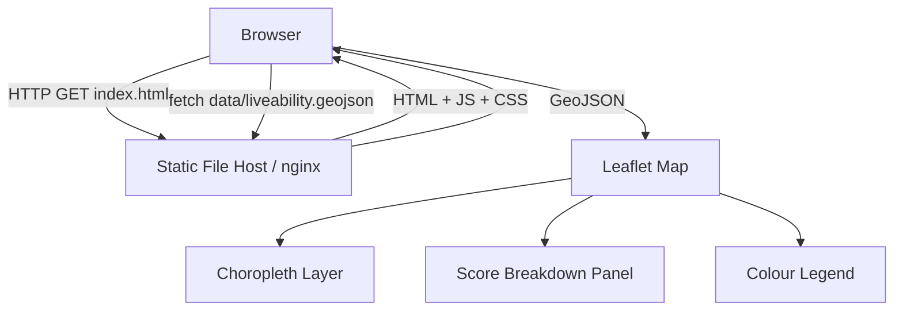
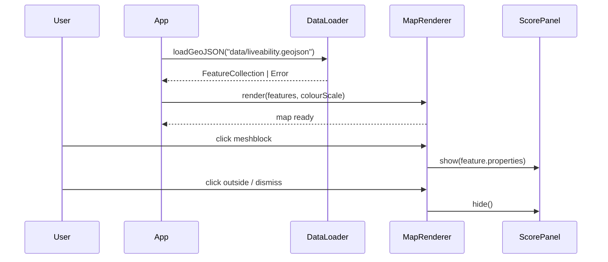

# Design Document: Liveability Map

## Overview

A single-page static web application that renders an interactive choropleth map of liveability scores at the meshblock level. Urban planners can pan/zoom the map, click any meshblock to see a score breakdown panel, and read a colour legend. All data is bundled as a static GeoJSON file — there is no backend server, no API, and no build-time data fetching.

The application is deployed by serving static files (HTML, CSS, JS, GeoJSON) from any web server or CDN. A Dockerfile is provided for container-based deployments.

### Technology Choices

| Concern | Choice | Rationale |
|---|---|---|
| Map rendering | [Leaflet.js](https://leafletjs.com/) | Lightweight, well-documented, no server required, excellent GeoJSON/choropleth support |
| Base tiles | OpenStreetMap (via Leaflet default) | Free, no API key required, works offline-friendly with tile caching |
| Build tooling | Vite | Fast dev server, produces optimised static bundle, zero config for vanilla JS |
| Language | Vanilla TypeScript | Keeps the bundle small; no framework overhead needed for this scope |
| Containerisation | Docker + nginx:alpine | Minimal image, serves static files, no runtime dependencies |

---

## Architecture

The application is entirely client-side. On load, the browser fetches the bundled GeoJSON file, computes the colour scale, and renders the choropleth. All subsequent interactions (click, pan, zoom) are handled in-browser with no network requests.



### Component Interaction



---

## Components and Interfaces

### DataLoader

Responsible for fetching and validating the GeoJSON file.

```typescript
interface MeshblockProperties {
  meshblock_id: string;
  liveability_score: number;
  sub_indicators: SubIndicator[];
}

interface SubIndicator {
  name: string;
  score: number;
}

interface MeshblockFeature extends GeoJSON.Feature<GeoJSON.Geometry, MeshblockProperties> {}

interface LoadResult {
  features: MeshblockFeature[];
  error?: string;
}

function loadGeoJSON(url: string): Promise<LoadResult>
```

- On network or parse failure, returns `{ features: [], error: "..." }`.
- Validates that each feature has `meshblock_id` and `liveability_score`; features missing these are skipped with a console warning.

### ColourScale

Computes a continuous colour scale from the observed score range.

```typescript
interface ColourScale {
  getColour(score: number): string;   // returns CSS hex colour
  min: number;
  max: number;
  stops: ColourStop[];                // for legend rendering
}

interface ColourStop {
  value: number;
  colour: string;
}

function buildColourScale(scores: number[]): ColourScale
```

- Uses a sequential colour ramp (e.g. light yellow → dark green) derived from the observed min/max of the loaded dataset.
- Because scores are unbounded, the scale is always data-driven — never hardcoded.

### MapRenderer

Wraps Leaflet and owns the map DOM element.

```typescript
interface MapRenderer {
  init(containerId: string): void;
  renderChoropleth(features: MeshblockFeature[], scale: ColourScale): void;
  onMeshblockClick(handler: (props: MeshblockProperties) => void): void;
  onMapClick(handler: () => void): void;
}
```

- Calls `onMeshblockClick` when a meshblock polygon is clicked (propagation stopped).
- Calls `onMapClick` when the map background is clicked (for dismiss).

### ScorePanel

A DOM overlay panel that displays the score breakdown.

```typescript
interface ScorePanel {
  show(props: MeshblockProperties): void;
  hide(): void;
}
```

- Renders overall `liveability_score` and a list of `sub_indicators`.
- If `sub_indicators` is empty or absent, shows a "detailed data unavailable" message.

### Legend

A Leaflet control that renders the colour scale.

```typescript
interface Legend {
  render(scale: ColourScale): L.Control;
}
```

---

## Data Models

### GeoJSON File Structure

The static data file (`data/liveability.geojson`) is a standard GeoJSON `FeatureCollection`:

```json
{
  "type": "FeatureCollection",
  "features": [
    {
      "type": "Feature",
      "geometry": {
        "type": "Polygon",
        "coordinates": [[[lng, lat], ...]]
      },
      "properties": {
        "meshblock_id": "MB123456",
        "liveability_score": 72.4,
        "sub_indicators": [
          { "name": "walkability", "score": 80.1 },
          { "name": "access_to_parks", "score": 65.3 },
          { "name": "public_transport_access", "score": 70.0 },
          { "name": "healthcare_access", "score": 74.2 }
        ]
      }
    }
  ]
}
```

**Field rules:**
- `meshblock_id` — required string, unique per feature.
- `liveability_score` — required number, unbounded, larger = better.
- `sub_indicators` — optional array; may be empty or absent.
- `sub_indicators[].name` — required string.
- `sub_indicators[].score` — required number.

### Colour Scale Model

The colour scale is computed at runtime from the loaded dataset:

```
min_score = min(all liveability_score values)
max_score = max(all liveability_score values)
normalised = (score - min_score) / (max_score - min_score)  // [0, 1]
colour = interpolate(COLOUR_RAMP, normalised)
```

If all scores are equal (degenerate case), all meshblocks receive the midpoint colour.

---

## Correctness Properties

*A property is a characteristic or behavior that should hold true across all valid executions of a system — essentially, a formal statement about what the system should do. Properties serve as the bridge between human-readable specifications and machine-verifiable correctness guarantees.*

