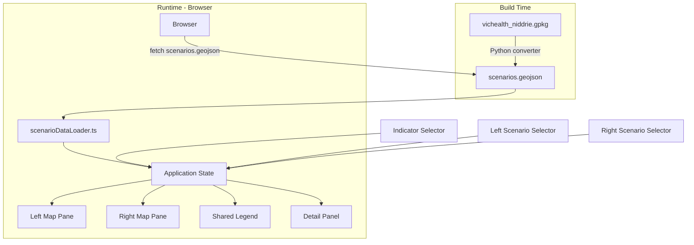
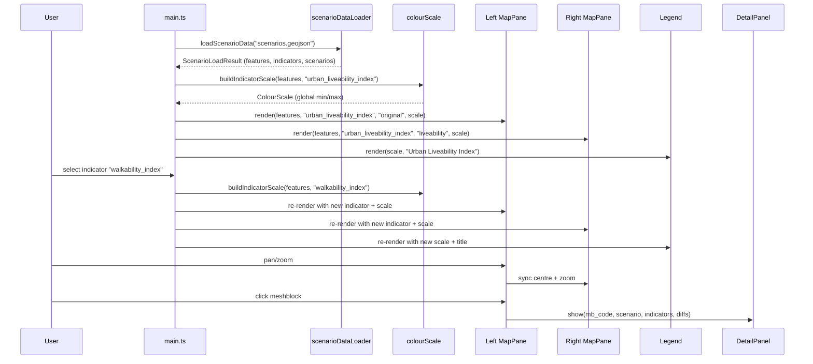

# Design Document: Scenario Comparison Map

## Overview

This feature upgrades the existing single-pane liveability map into a side-by-side scenario comparison tool. Users select one of eight indicators and two of four planning scenarios, then visually compare choropleth maps rendered with a shared, indicator-wise colour scale. The data pipeline is extended with a new Python converter that reads the GeoPackage (`vichealth_niddrie.gpkg`) and produces a flat GeoJSON file where each meshblock feature carries all indicator×scenario columns as top-level properties. The frontend is restructured to support dual synchronised Leaflet map panes, dropdown selectors for indicator and scenario, a shared legend, and a click-to-inspect detail panel.

### Technology Choices

| Concern | Choice | Rationale |
|---|---|---|
| Map rendering | Leaflet.js (existing) | Already in use; supports multiple map instances and programmatic sync |
| Map sync | Manual event wiring (`moveend`/`zoomend`) | Lightweight; avoids adding a Leaflet sync plugin dependency |
| Build tooling | Vite + TypeScript (existing) | No change needed |
| Data conversion | Python script using `sqlite3` (stdlib) | GeoPackage is SQLite-based; no extra dependency beyond what `vic_health` already uses |
| Colour ramp | Existing `colourScale.ts` module, extended | Reuse the YlGn ramp; only change is how min/max are computed (global across scenarios) |
| Property-based testing | `fast-check` (TypeScript) | Mature PBT library for JS/TS; integrates with Vitest/Jest |
| Unit testing | Vitest | Fast, Vite-native test runner; zero extra config |

---

## Architecture

The system has two phases: a **build-time data conversion** step (Python) and a **client-side rendering** step (TypeScript/Leaflet). The converter runs once to produce a static GeoJSON file that the frontend fetches at load time.



### Component Interaction



---

## Components and Interfaces

### Data Converter (Python)

A new Python script `vic_health/gpkg_to_geojson.py` that reads the GeoPackage and writes a flat GeoJSON file.

```python
def convert_gpkg(gpkg_path: str, output_path: str) -> ConversionResult:
    """
    Read all rows from the vichealth_niddrie table in the GeoPackage,
    convert each geometry from GeoPackage binary to GeoJSON coordinates,
    and write a FeatureCollection with all indicator columns as flat properties.
    
    Returns ConversionResult with feature_count and skipped_count.
    """

@dataclass
class ConversionResult:
    output_path: Path
    feature_count: int
    skipped_count: int
```

The converter:
- Connects via `sqlite3` (GeoPackage is SQLite)
- Reads the `gpkg_geometry_columns` metadata table to identify the geometry column
- Parses GeoPackage binary geometry (header + WKB) into GeoJSON coordinate arrays
- Emits each row as a GeoJSON Feature with `mb_code` and all `{indicator}_{scenario}` and `{indicator}_diff_{scenario}` columns as flat properties
- Logs a warning and skips any row whose geometry cannot be parsed
- Writes the output to `liveability-map/public/data/scenarios.geojson`

### ScenarioDataLoader (TypeScript)

Replaces the existing `dataLoader.ts` for the comparison view. Fetches the new GeoJSON and parses column names into structured indicator/scenario data.

```typescript
interface ScenarioFeature extends GeoJSON.Feature<GeoJSON.Geometry, Record<string, unknown>> {
  properties: {
    mb_code: number;
    [key: string]: unknown;  // {indicator}_{scenario} and {indicator}_diff_{scenario}
  };
}

interface ScenarioLoadResult {
  features: ScenarioFeature[];
  indicators: string[];       // e.g. ["urban_liveability_index", "walkability_index", ...]
  scenarios: string[];        // e.g. ["original", "probable", "community", "liveability"]
  error?: string;
}

function loadScenarioData(url: string): Promise<ScenarioLoadResult>
```

**Column parsing logic**: iterate over property keys of the first feature, match against the pattern `{indicator}_{scenario}` where `{scenario}` is one of the four known scenario names. Extract unique indicator names and scenario names. Diff columns (`{indicator}_diff_{scenario}`) are identified separately and not included in the indicator/scenario lists.

### IndicatorLabels (TypeScript)

A lookup module that maps column names to human-readable labels.

```typescript
const INDICATOR_LABELS: Record<string, string> = {
  urban_liveability_index: "Urban Liveability Index",
  social_infrastructure_index: "Social Infrastructure Index",
  walkability_dwelling_density: "Walkability – Dwelling Density",
  walkability_daily_living_score: "Walkability – Daily Living",
  walkability_index: "Walkability Index",
  transport_percent_dwellings_400m_regular_pt: "Transport – Dwellings near PT",
  housing_percent_social_housing: "Housing – Social Housing %",
  pos_closest_large: "Closest Large Public Open Space",
};

const SCENARIO_LABELS: Record<string, string> = {
  original: "Original",
  probable: "Probable",
  community: "Community",
  liveability: "Liveability",
};

function indicatorLabel(key: string): string;
function scenarioLabel(key: string): string;
```

### ColourScale (extended)

The existing `buildColourScale(scores: number[])` function is reused. A new helper computes the global min/max for a given indicator across all scenarios:

```typescript
function buildIndicatorScale(
  features: ScenarioFeature[],
  indicator: string,
  scenarios: string[],
): ColourScale
```

This function:
1. Collects all values of `{indicator}_{scenario}` for every scenario
2. Filters out `null`/`undefined` values
3. Passes the combined array to `buildColourScale`

The result is a single `ColourScale` where the same value always maps to the same colour regardless of which scenario pane it appears in.

### ComparisonMap (TypeScript)

Manages the two synchronised Leaflet map instances.

```typescript
interface MapPane {
  init(containerId: string): void;
  renderChoropleth(
    features: ScenarioFeature[],
    indicator: string,
    scenario: string,
    scale: ColourScale,
  ): void;
  fitBounds(bounds: L.LatLngBoundsExpression): void;
  getMap(): L.Map;
  onFeatureClick(handler: (feature: ScenarioFeature) => void): void;
  onBackgroundClick(handler: () => void): void;
}

interface ComparisonMap {
  init(leftContainerId: string, rightContainerId: string): void;
  renderLeft(features: ScenarioFeature[], indicator: string, scenario: string, scale: ColourScale): void;
  renderRight(features: ScenarioFeature[], indicator: string, scenario: string, scale: ColourScale): void;
  fitToData(features: ScenarioFeature[]): void;
  onFeatureClick(handler: (feature: ScenarioFeature, pane: 'left' | 'right') => void): void;
  onBackgroundClick(handler: () => void): void;
}
```

**Synchronisation**: when either map fires `moveend` or `zoomend`, the handler reads the source map's centre and zoom, then calls `setView` on the other map with `{ animate: false }`. A guard flag prevents infinite recursion.

### Legend (extended)

The existing `createLegend()` is extended to accept a title parameter:

```typescript
interface Legend {
  render(scale: ColourScale, title: string): L.Control;
  update(scale: ColourScale, title: string): void;
}
```

The legend is rendered once (outside either map pane, or attached to a fixed DOM position) and shared between both panes.

### DetailPanel (TypeScript)

Replaces the existing `scorePanel.ts` with scenario-aware detail display.

```typescript
interface DetailPanelData {
  mb_code: number;
  scenario: string;
  indicators: Array<{ name: string; label: string; value: number | null }>;
  diffs: Array<{ name: string; label: string; value: number | null }>;
}

interface DetailPanel {
  show(data: DetailPanelData): void;
  hide(): void;
}
```

The panel shows:
- Meshblock code
- Scenario name
- All indicator values for that scenario, with human-readable labels
- Diff-from-original values where available (formatted with +/− sign)

### Selectors (TypeScript)

Thin wrappers around `<select>` elements:

```typescript
interface SelectorOptions {
  containerId: string;
  label: string;
  options: Array<{ value: string; label: string }>;
  defaultValue: string;
  onChange: (value: string) => void;
}

function createSelector(opts: SelectorOptions): HTMLSelectElement;
```

Three selectors are created:
1. **Indicator selector** — controls which indicator both panes display
2. **Left scenario selector** — controls the left pane's scenario (default: `original`)
3. **Right scenario selector** — controls the right pane's scenario (default: `liveability`)

---

## Data Models

### GeoJSON Output Structure (scenarios.geojson)

The converter produces a standard GeoJSON FeatureCollection with flat properties:

```json
{
  "type": "FeatureCollection",
  "features": [
    {
      "type": "Feature",
      "geometry": {
        "type": "Polygon",
        "coordinates": [[[lng, lat], ...]]
      },
      "properties": {
        "mb_code": 20443680000.0,
        "urban_liveability_index_original": 0.72,
        "urban_liveability_index_probable": 0.74,
        "urban_liveability_index_community": 0.78,
        "urban_liveability_index_liveability": 0.81,
        "urban_liveability_index_diff_probable": 0.02,
        "urban_liveability_index_diff_community": 0.06,
        "urban_liveability_index_diff_liveability": 0.09,
        "walkability_index_original": 0.65,
        "...": "..."
      }
    }
  ]
}
```

**Field rules:**
- `mb_code` — required number (REAL in the GeoPackage), unique per feature
- `{indicator}_{scenario}` — number or `null` if missing in the source
- `{indicator}_diff_{scenario}` — number or `null`; not present for `original` scenario (it is the baseline)
- Coordinate order: `[longitude, latitude]` per RFC 7946

### Column Name Parsing

The frontend parses property keys using this logic:

```
Known scenarios: ["original", "probable", "community", "liveability"]

For each property key:
  1. If key matches {prefix}_diff_{scenario}: it's a diff column
  2. Else if key ends with _{scenario}: it's an indicator column
     indicator = key with trailing _{scenario} removed
  3. Else: it's a non-indicator column (e.g., mb_code)
```

### Application State

```typescript
interface AppState {
  features: ScenarioFeature[];
  indicators: string[];
  scenarios: string[];
  selectedIndicator: string;       // default: "urban_liveability_index"
  leftScenario: string;            // default: "original"
  rightScenario: string;           // default: "liveability"
  currentScale: ColourScale;       // recomputed on indicator change
}
```

State changes trigger re-renders:
- **Indicator change** → recompute colour scale → re-render both panes + legend
- **Left scenario change** → re-render left pane only (scale unchanged)
- **Right scenario change** → re-render right pane only (scale unchanged)

### GeoPackage Binary Geometry Format

The GeoPackage stores geometry in a binary format (not WKB directly). The structure is:

```
[2 bytes: magic "GP"]
[1 byte: version]
[1 byte: flags — encodes envelope type and byte order]
[4 bytes: SRID as int32]
[variable: envelope (bounding box), size depends on flags]
[remaining: standard WKB geometry]
```

The converter must:
1. Read the 8-byte header to determine byte order and envelope size
2. Skip the envelope bytes
3. Parse the remaining bytes as standard WKB (Well-Known Binary)
4. Convert WKB polygon coordinates to GeoJSON `[lng, lat]` arrays


---

## Correctness Properties

*A property is a characteristic or behavior that should hold true across all valid executions of a system — essentially, a formal statement about what the system should do. Properties serve as the bridge between human-readable specifications and machine-verifiable correctness guarantees.*

### Property 1: Converter Output Completeness

*For any* set of meshblock rows in the GeoPackage (each with a valid geometry, an `mb_code`, and a set of `{indicator}_{scenario}` and `{indicator}_diff_{scenario}` columns), the converter SHALL produce a GeoJSON FeatureCollection where: (a) the number of features equals the number of input rows with valid geometry, (b) every feature contains `mb_code`, (c) every `{indicator}_{scenario}` column from the input appears as a property in the output with the same name, and (d) every `{indicator}_diff_{scenario}` column appears likewise.

**Validates: Requirements 1.1, 1.2, 1.3, 1.4**

### Property 2: Graceful Geometry Skip

*For any* list of meshblock rows where some have valid geometry and some have unparseable geometry, the converter SHALL produce output containing exactly the rows with valid geometry, and the count of skipped rows SHALL equal the number of rows with invalid geometry. The converter SHALL not abort.

**Validates: Requirements 1.5**

### Property 3: Conversion Round-Trip

*For any* valid meshblock record (with a parseable polygon geometry and numeric indicator values), converting to GeoJSON and parsing the JSON back SHALL produce geometry coordinates and indicator values equivalent to the originals (within floating-point tolerance for coordinates).

**Validates: Requirements 1.6**

### Property 4: Column Name Parsing Correctness

*For any* GeoJSON feature whose properties contain keys following the `{indicator}_{scenario}` naming convention (where scenario is one of the four known values), the column parser SHALL extract the complete set of unique indicator names and the complete set of unique scenario names, with no false positives and no omissions.

**Validates: Requirements 2.3, 2.4**

### Property 5: Human-Readable Label Completeness

*For any* indicator key in the known set of eight indicators, `indicatorLabel(key)` SHALL return a non-empty string that is not equal to the raw key. *For any* scenario key in the known set of four scenarios, `scenarioLabel(key)` SHALL return a non-empty string that is not equal to the raw key.

**Validates: Requirements 3.4, 4.4**

### Property 6: Global Indicator Scale

*For any* set of ScenarioFeatures and *for any* indicator name, `buildIndicatorScale` SHALL produce a ColourScale whose `min` equals the minimum of that indicator's values across all scenarios and all features, and whose `max` equals the maximum across all scenarios and all features (excluding null/undefined values).

**Validates: Requirements 6.1**

### Property 7: Colour Scale Determinism

*For any* ColourScale and *for any* numeric value within the scale's `[min, max]` range, calling `getColour(value)` multiple times SHALL always return the same CSS colour string.

**Validates: Requirements 6.4**

### Property 8: Detail Panel Data Completeness

*For any* ScenarioFeature and *for any* selected scenario, extracting detail panel data SHALL produce an object containing: (a) the feature's `mb_code`, (b) a value for every indicator in that scenario (or null if missing), and (c) the corresponding diff value for every indicator that has a `{indicator}_diff_{scenario}` column (or null if missing).

**Validates: Requirements 8.1, 8.4**

### Property 9: Missing Value Exclusion from Scale

*For any* set of ScenarioFeatures where some features have `null` or `undefined` for the selected indicator column, `buildIndicatorScale` SHALL compute its min and max only from non-null values, and the null-valued features SHALL be excluded from the scale range.

**Validates: Requirements 9.3**

---

## Error Handling

| Scenario | Component | Behaviour |
|---|---|---|
| GeoPackage file not found | Data Converter | Print error message; exit with non-zero code |
| Geometry parse failure for a row | Data Converter | Log warning with mb_code; skip the row; continue processing |
| Data file fetch fails (HTTP error) | ScenarioDataLoader | Return `{ features: [], error: "Failed to fetch: {status} {statusText}" }` |
| Data file parse fails (invalid JSON) | ScenarioDataLoader | Return `{ features: [], error: "Failed to parse: {message}" }` |
| Data file has no features | ScenarioDataLoader | Return `{ features: [], error: "No features found in data file" }` |
| Feature missing selected indicator column | ComparisonMap | Render meshblock with `#cccccc` (neutral grey) fill; exclude from scale computation |
| Feature missing mb_code | ScenarioDataLoader | Skip feature with console warning |
| Map sync infinite loop | ComparisonMap | Guard flag (`_syncing`) prevents recursive `setView` calls |
| Indicator/scenario key not in label map | IndicatorLabels | Return the raw key as fallback (no crash) |

Error messages are displayed in the existing `#error-banner` element. The banner is shown by adding the `visible` class, consistent with the current implementation.

---

## Testing Strategy

### Dual Testing Approach

- **Unit tests** (Vitest): specific examples, edge cases, error conditions, DOM interactions
- **Property tests** (fast-check + Vitest): universal properties across randomly generated inputs
- **Python unit tests** (pytest): converter logic, geometry parsing

Both are complementary: unit tests catch concrete bugs at specific boundaries, property tests verify general correctness across the input space.

### Property-Based Tests (fast-check)

Each property from the Correctness Properties section maps to one `fc.assert(fc.property(...))` test, configured with `{ numRuns: 100 }` minimum.

Tag format in test descriptions: `Feature: scenario-comparison-map, Property {N}: {property_text}`

| Test | Property | Key Generators |
|---|---|---|
| `converter output completeness` | P1 | Generate random rows with mb_code + random indicator/scenario columns |
| `graceful geometry skip` | P2 | Generate mix of valid WKB blobs and garbage bytes |
| `conversion round-trip` | P3 | Generate random polygon coordinates + indicator values |
| `column name parsing` | P4 | `fc.record` with random `{indicator}_{scenario}` keys from known sets |
| `label completeness` | P5 | `fc.constantFrom(...INDICATOR_KEYS)` and `fc.constantFrom(...SCENARIO_KEYS)` |
| `global indicator scale` | P6 | `fc.array(fc.record({...}))` with random indicator values per scenario |
| `colour scale determinism` | P7 | `fc.float({ min, max })` applied to a generated scale |
| `detail panel data completeness` | P8 | `fc.record` with random feature properties + `fc.constantFrom(...scenarios)` |
| `missing value exclusion` | P9 | `fc.array` of features with `fc.option(fc.float())` for indicator values |

### Unit / Example-Based Tests (Vitest)

- **ScenarioDataLoader**: fetches and parses a fixture GeoJSON file correctly (2.1)
- **ScenarioDataLoader**: returns error for HTTP 404 response (9.1)
- **ScenarioDataLoader**: returns error for empty FeatureCollection (9.2)
- **Indicator selector**: renders all 8 indicators as options (3.1)
- **Indicator selector**: defaults to `urban_liveability_index` (3.3)
- **Scenario selectors**: left defaults to `original`, right to `liveability` (4.3)
- **Scenario selectors**: display all 4 scenarios (4.1)
- **ComparisonMap**: two panes are rendered side by side (5.1)
- **ComparisonMap**: panes sync on pan/zoom (5.2)
- **ComparisonMap**: panes are labelled with scenario names (5.3)
- **ComparisonMap**: both panes fit to data bounds on init (5.4)
- **Legend**: renders colour stops and value ranges (7.1)
- **Legend**: title shows human-readable indicator name (7.2)
- **Legend**: exactly one legend in the DOM (7.4)
- **DetailPanel**: shows mb_code and indicator values on click (8.1)
- **DetailPanel**: hides on background click (8.2)
- **DetailPanel**: shows human-readable labels (8.3)
- **Missing indicator**: meshblock rendered grey (9.3)

### Python Tests (pytest)

- **Converter**: produces valid GeoJSON from the real GeoPackage (integration)
- **Converter**: handles empty GeoPackage table gracefully
- **Geometry parser**: correctly parses GeoPackage binary header + WKB for known test vectors
- **Geometry parser**: returns None for malformed binary data
- **Converter**: output file is valid JSON and loadable by the frontend data loader contract

### Test Configuration

- Vitest with `fast-check`: add `vitest` and `fast-check` as dev dependencies
- pytest for Python converter tests (already available in the project)
- Property tests run minimum 100 iterations each
- Each property test includes a comment referencing its design property number and text
